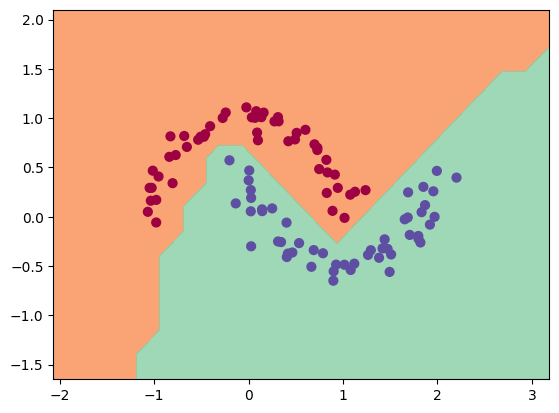
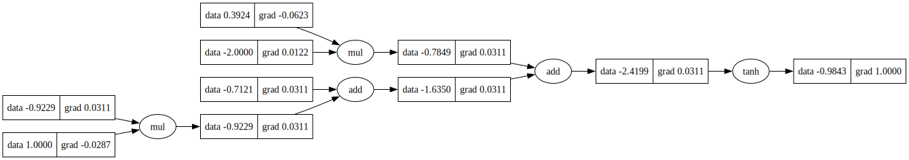

# nanograd

(following Karpathy's micrograd as a learning reference) A small mimic of Autograd, PyTorch's automatic differentiation engine which implements backpropagation over a dynamically built DAG and a tiny neural networks library on top of it with a PyTorch-like API. the DAG only works over scalar values, e.g. we divide each neuron into all of its individual tiny adds and multiplies. But it's enough to build up entire deep neural nets doing binary classification, as the demo notebook shows.

### Example usage

Below is a slightly contrived example showing a number of possible supported operations:

```python
from bitgrad.grad import Value

a = Value(-3.0)
b = Value(1.0)
c = a + b
d = a ** 2 + a * b
c += c + 1
d += d * 2 + (b + a).relu()
e = c - d
f = e ** 2
g = f / 2.0
g += 10.0 / f
print(f'{g.data:.4f}')  # prints 220.5227, the outcome of this forward pass
g.backward()
print(f'{a.grad:.4f}')  # prints -356.9633, the numerical value of dg/da
print(f'{b.grad:.4f}')  # prints -230.9762, the numerical value of dg/db
```

### Training a neural net

The `demo.ipynb` notebook contains a complete, end-to-end example of training a two-layer multi-layer perceptron (MLP) to serve as a binary classifier. It demonstrates how to instantiate the network using the `bitgrad.nn` module, define a simple max-margin (SVM-style) loss for binary classification, and optimize the parameters with stochastic gradient descent (SGD). The notebook specifically shows the decision boundary produced on the moons dataset when the model has two hidden layers, each with 16 neurons:


### Tracing / visualization

To make tracing easier, the `dag.ipynb` notebook generates Graphviz diagrams of the computation graph. For example, the diagram shown here depicts a basic 2D neuron and is created by passing the root value to the `draw_dot` function in the preceding code. Each node displays the forward-pass value on the left and the backward-pass gradient on the right.

```python
import random
from bitgrad import nn

random.seed(43)
n = nn.Neuron(2)
x = [Value(1.0), Value(-2.0)]
y = n(x)
y.backward()

dot = draw_dot(y)
```



### Running tests

To run the unit tests you will have to install [PyTorch](https://pytorch.org/), which the tests use as a reference for verifying the correctness of the calculated gradients. Then simply:

```bash
python -m pytest
```
